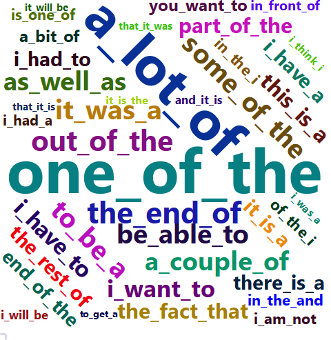
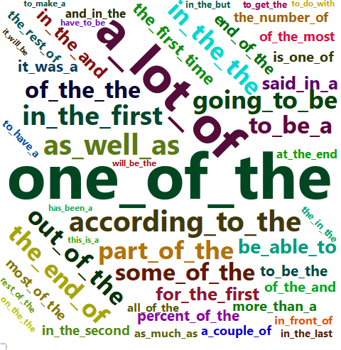
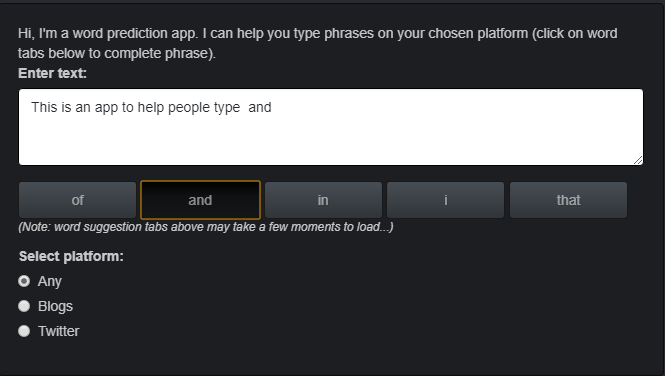
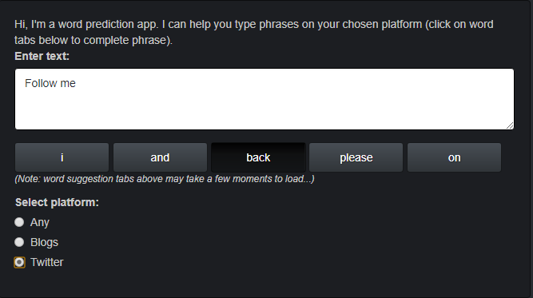

WordPred App
========================================================
date: 10/10/21
autosize: true
transition: rotate
font-family: 'Lucida'

    
    
    
    

What is it?
========================================================

**A Word Prediction App to Suit Your Platform Needs!**

Our research showed that common speech patterns are often **unique to the given platform.** The way people talk on Twitter was notably different to communication via blogs and the news. **So we thought why not give our users the choice?**

The best user experiences come from products that are **user focused** and our app is all about what the user wants! Whether they're writing a punchy tweet or blogging about their last holiday, the **WordPred App has got them covered.**

<figure align="center">
    
    
    
    <figcaption> 
 Wordcloud of groups of three words for text sampled from blogs, news and twitter 

    </figcaption>    
</figure>

How does it work?
========================================================

- Word predictions generated from blog, news and twitter texts (over 1m sentences)
- Created n-grams from sentences (sequences of "n" words) - e.g. "the cat sat" is a 3-gram (or "tri-gram")
- Dataset contains 1-,2-,3-,4-grams. Also, to reduce the size of the dataset and increase the prediction speed, n-grams retained only if they appeared more than once
- Katz Back-Off (KBO) algorithm used to compute probability of next word based on last three words of input phrase
- KBO algorithm will always provide five predictions as it computes probability of unobserved phrase completions (Markov chain methods limited to observed phrases)
- Dynamic KBO model - can handle n-grams to an unlimited size of "n"

Easy-to-Use Interface
========================================================

- Users simply enter text in the white box - bold colour contrast for better usability
- Click on any of the **five suggested words** below to complete the input phrase
- Text box updates with their selection 

Switch Between Platforms
========================================================

- Check boxes below text input box allow users to change platforms
- Word predictions will be generated from text extracted from selected platform

Click [**here**](https://pseud-acc.shinyapps.io/WordPredApp/)  to start using the App!

[**Github project**: https://github.com/pseud-acc/WordPred](https://github.com/pseud-acc/WordPred)

